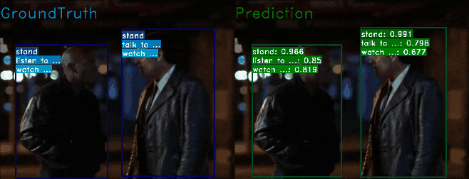

<div align="center">
  
</div>

## 简介

[English](/README.md) | 简体中文

[](https://mmaction2.readthedocs.io/en/latest/)
[](https://github.com/open-mmlab/mmaction2/actions)
[](https://codecov.io/gh/open-mmlab/mmaction2)
[](https://pypi.org/project/mmaction2/)
[](https://github.com/open-mmlab/mmaction2/blob/master/LICENSE)
[](https://github.com/open-mmlab/mmaction2/issues)
[](https://github.com/open-mmlab/mmaction2/issues)

MMAction2 是一款基于 PyTorch 的视频理解开源工具箱，是 [OpenMMLab](http://openmmlab.org/) 项目的成员之一

主分支代码目前支持 **PyTorch 1.3 以上**的版本

<div align="center">
  <br>
    Kinetics-400 上的动作识别
</div>
<div align="center">
  <br>
    AVA-2.1 上的时空动作检测
</div>

## 主要特性

- **模块化设计**
  MMAction2 将统一的视频理解框架解耦成不同的模块组件，通过组合不同的模块组件，用户可以便捷地构建自定义的视频理解模型

- **支持多样的数据集**
  MMAction2 支持多种数据集的准备和构建，包括 UCF101, Kinetics-[400/600/700], Something-Something V1&V2, Moments in Time, Multi-Moments in Time, THUMOS14 等

- **支持多种视频理解任务**
  MMAction2 支持多种主流的视频理解任务

  - 动作识别：TSN, TSM, TIN, R(2+1)D, I3D, SlowOnly, SlowFast, CSN, Non-local 等
  - 时序动作检测：BSN, BMN, SSN
  - 时空动作检测：SlowOnly + Fast-RCNN, SlowFast + Fast-RCNN

  具体可参考 [模型库](#模型库)

- **详尽的单元测试和文档**
  MMAction2 提供了详尽的说明文档，API 接口说明，全面的单元测试，以供社区参考

## 更新记录

v0.12.0 版本已于 2021 年 2 月 28 日发布，可通过查阅 [更新日志](/docs/changelog.md) 了解更多细节以及发布历史

## 基准测试

| Model  |input| io backend | batch size x gpus | MMAction2 (s/iter) | MMAction (s/iter) | Temporal-Shift-Module (s/iter) | PySlowFast (s/iter) |
| :--- | :---------------:|:---------------:| :---------------:| :---------------:  | :--------------------: | :----------------------------: | :-----------------: |
| [TSN](/configs/recognition/tsn/tsn_r50_1x1x3_100e_kinetics400_rgb.py)| 256p rawframes |Memcached| 32x8|**[0.32](https://download.openmmlab.com/mmaction/benchmark/recognition/mmaction2/tsn_256p_rawframes_memcahed_32x8.zip)** | [0.38](https://download.openmmlab.com/mmaction/benchmark/recognition/mmaction/tsn_256p_rawframes_memcached_32x8.zip)| [0.42](https://download.openmmlab.com/mmaction/benchmark/recognition/temporal_shift_module/tsn_256p_rawframes_memcached_32x8.zip)| x |
| [TSN](/configs/recognition/tsn/tsn_r50_video_1x1x3_100e_kinetics400_rgb.py)| 256p dense-encoded video |Disk| 32x8|**[0.61](https://download.openmmlab.com/mmaction/benchmark/recognition/mmaction2/tsn_256p_fast_videos_disk_32x8.zip)**| x | x | TODO |
|[I3D heavy](/configs/recognition/i3d/i3d_r50_video_heavy_8x8x1_100e_kinetics400_rgb.py)|256p videos|Disk |8x8| **[0.34](https://download.openmmlab.com/mmaction/benchmark/recognition/mmaction2/i3d_heavy_256p_videos_disk_8x8.zip)** | x | x | [0.44](https://download.openmmlab.com/mmaction/benchmark/recognition/pyslowfast/pysf_i3d_r50_8x8_video.log) |
| [I3D](/configs/recognition/i3d/i3d_r50_32x2x1_100e_kinetics400_rgb.py)|256p rawframes|Memcached|8x8| **[0.43](https://download.openmmlab.com/mmaction/benchmark/recognition/mmaction2/i3d_256p_rawframes_memcahed_8x8.zip)** | [0.56](https://download.openmmlab.com/mmaction/benchmark/recognition/mmaction/i3d_256p_rawframes_memcached_8x8.zip) | x | x |
| [TSM](/configs/recognition/tsm/tsm_r50_1x1x8_50e_kinetics400_rgb.py) |256p rawframes|Memcached| 8x8|**[0.31](https://download.openmmlab.com/mmaction/benchmark/recognition/mmaction2/tsm_256p_rawframes_memcahed_8x8.zip)** | x | [0.41](https://download.openmmlab.com/mmaction/benchmark/recognition/temporal_shift_module/tsm_256p_rawframes_memcached_8x8.zip) | x |
| [Slowonly](/configs/recognition/slowonly/slowonly_r50_video_4x16x1_256e_kinetics400_rgb.py)|256p videos|Disk|8x8 | **[0.32](https://download.openmmlab.com/mmaction/benchmark/recognition/mmaction2/slowonly_256p_videos_disk_8x8.zip)** | TODO | x | [0.34](https://download.openmmlab.com/mmaction/benchmark/recognition/pyslowfast/pysf_slowonly_r50_4x16_video.log) |
| [Slowfast](/configs/recognition/slowfast/slowfast_r50_video_4x16x1_256e_kinetics400_rgb.py)|256p videos|Disk|8x8 | **[0.69](https://download.openmmlab.com/mmaction/benchmark/recognition/mmaction2/slowfast_256p_videos_disk_8x8.zip)** | x | x | [1.04](https://download.openmmlab.com/mmaction/benchmark/recognition/pyslowfast/pysf_slowfast_r50_4x16_video.log) |
| [R(2+1)D](/configs/recognition/r2plus1d/r2plus1d_r34_video_8x8x1_180e_kinetics400_rgb.py)|256p videos |Disk| 8x8|**[0.45](https://download.openmmlab.com/mmaction/benchmark/recognition/mmaction2/r2plus1d_256p_videos_disk_8x8.zip)** | x | x | x |

更多详情可见 [基准测试](/docs/benchmark.md)

## 模型库

支持的行为识别方法：

<details open>
<summary>(点击收起)</summary>

- [x] [TSN](/configs/recognition/tsn/README.md) (ECCV'2016)
- [x] [TSM](/configs/recognition/tsm/README.md) (ICCV'2019)
- [x] [TSM Non-Local](/configs/recognition/i3d) (ICCV'2019)
- [x] [R(2+1)D](/configs/recognition/r2plus1d/README.md) (CVPR'2018)
- [x] [I3D](/configs/recognition/i3d/README.md) (CVPR'2017)
- [x] [I3D Non-Local](/configs/recognition/i3d/README.md) (CVPR'2018)
- [x] [SlowOnly](/configs/recognition/slowonly/README.md) (ICCV'2019)
- [x] [SlowFast](/configs/recognition/slowfast/README.md) (ICCV'2019)
- [x] [CSN](/configs/recognition/csn/README.md) (ICCV'2019)
- [x] [TIN](/configs/recognition/tin/README.md) (AAAI'2020)
- [x] [TPN](/configs/recognition/tpn/README.md) (CVPR'2020)
- [x] [C3D](/configs/recognition/c3d/README.md) (CVPR'2014)
- [x] [X3D](/configs/recognition/x3d/README.md) (CVPR'2020)
- [x] [OmniSource](/configs/recognition/omnisource/README.md) (ECCV'2020)
- [x] [MultiModality: Audio](/configs/recognition_audio/resnet/README.md) (ArXiv'2020)

</details>

支持的时序动作检测方法：

<details open>
<summary>(点击收起)</summary>

- [x] [BSN](/configs/localization/bsn/README.md) (ECCV'2018)
- [x] [BMN](/configs/localization/bmn/README.md) (ICCV'2019)
- [x] [SSN](/configs/localization/ssn/README.md) (ICCV'2017)

</details>

支持的时空检测方法：

<details open>
<summary>(点击收起)</summary>

- [x] [SlowOnly+Fast R-CNN](/configs/detection/ava/README.md) (ICCV'2019)
- [x] [SlowFast+Fast R-CNN](/configs/detection/ava/README.md) (ICCV'2019)

</details>

各个模型的结果和设置都可以在对应的 config 目录下的 *README.md* 中查看。整体的概况也可也在 [**模型库**](https://mmaction2.readthedocs.io/en/latest/recognition_models.html) 页面中查看

我们将跟进学界的最新进展，并支持更多算法和框架。如果您对 MMAction2 有任何功能需求，请随时在 [问题](https://github.com/open-mmlab/mmaction2/issues/19) 中留言。

## 数据集

支持的 [数据集](https://mmaction2.readthedocs.io/en/latest/supported_datasets.html)：

支持的动作识别数据集：

<details open>
<summary>(点击收起)</summary>

- [x] [UCF101](/tools/data/ucf101/README.md) \[ [主页](https://www.crcv.ucf.edu/research/data-sets/ucf101/) \] (CRCV-IR-12-01)
- [x] [HMDB51](/tools/data/hmdb51/README.md) \[ [主页](https://serre-lab.clps.brown.edu/resource/hmdb-a-large-human-motion-database/) \] (ICCV'2011)
- [x] [Kinetics-[400/600/700]](/tools/data/kinetics/README.md) \[ [主页](https://deepmind.com/research/open-source/kinetics) \] (CVPR'2017)
- [x] [Something-Something V1](/tools/data/sthv1/README.md) \[ [主页](https://20bn.com/datasets/something-something/v1) \] (ICCV'2017)
- [x] [Something-Something V2](/tools/data/sthv2/README.md) \[ [主页](https://20bn.com/datasets/something-something) \] (ICCV'2017)
- [x] [Moments in Time](/tools/data/mit/README.md) \[ [主页](http://moments.csail.mit.edu/) \] (TPAMI'2019)
- [x] [Multi-Moments in Time](/tools/data/mmit/README.md) \[ [主页](http://moments.csail.mit.edu/challenge_iccv_2019.html) \] (ArXiv'2019)
- [x] [HVU](/tools/data/hvu/README.md) \[ [主页](https://github.com/holistic-video-understanding/HVU-Dataset) \] (ECCV'2020)
- [x] [Jester](/tools/data/jester/README.md) \[ [主页](https://20bn.com/datasets/jester/v1) \] (ICCV'2019)
- [x] [GYM](/tools/data/gym/README.md) \[ [主页](https://sdolivia.github.io/FineGym/) \] (CVPR'2020)
- [x] [ActivityNet](/tools/data/activitynet/README.md) \[ [主页](http://activity-net.org/) \] (CVPR'2015)

</details>

支持的时序动作检测数据集：

<details open>
<summary>(点击收起)</summary>

- [x] [ActivityNet](/tools/data/activitynet/README.md) \[ [主页](http://activity-net.org/) \] (CVPR'2015)
- [x] [THUMOS14](/tools/data/thumos14/README.md) \[ [主页](https://www.crcv.ucf.edu/THUMOS14/download.html) \] (THUMOS Challenge 2014)

</details>

支持的时空动作检测数据集：

<details open>
<summary>(点击收起)</summary>

- [x] [AVA](/tools/data/ava/README.md) \[ [主页](https://research.google.com/ava/index.html) \] (CVPR'2018)
- [x] [UCF101-24](/tools/data/ucf101_24/README.md) \[ [主页](http://www.thumos.info/download.html) \] (CRCV-IR-12-01)
- [x] [JHMDB](/tools/data/jhmdb/README.md) \[ [主页](http://jhmdb.is.tue.mpg.de/) \] (ICCV'2013)

</details>

## 安装

请参考 [安装指南](/docs/install.md) 进行安装

## 数据集准备

请参考 [数据准备](/docs/data_preparation.md) 了解数据集准备概况。所有支持的数据集都列于 [数据集清单](/docs/supported_datasets.md) 中

## 教程

请参考 [基础教程](/docs/getting_started.md) 了解 MMAction2 的基本使用。MMAction2也提供了其他更详细的教程:

- [如何编写配置文件](/docs/tutorials/1_config.md)
- [如何微调模型](/docs/tutorials/2_finetune.md)
- [如何增加新数据集](/docs/tutorials/3_new_dataset.md)
- [如何设计数据处理流程](/docs/tutorials/4_data_pipeline.md)
- [如何增加新模块](/docs/tutorials/5_new_modules.md)
- [如何导出模型为 onnx 格式](/docs/tutorials/6_export_model.md)
- [如何自定义模型运行参数](/docs/tutorials/7_customize_runtime.md)

## 常见问题

请参考 [FAQ](/docs/faq.md) 了解其他用户的常见问题

## 许可

该项目开源自 [Apache 2.0 license](/LICENSE)

## 引用

如果你觉得 MMAction2 对你的研究有所帮助，可以考虑引用它：

```BibTeX
@misc{2020mmaction2,
    title={OpenMMLab's Next Generation Video Understanding Toolbox and Benchmark},
    author={MMAction2 Contributors},
    howpublished = {\url{https://github.com/open-mmlab/mmaction2}},
    year={2020}
}
```

## 参与贡献

我们非常欢迎用户对于 MMAction2 做出的任何贡献，可以参考 [贡献指南](/.github/CONTRIBUTING.md) 文件了解更多细节

## 致谢

MMAction2 是一款由不同学校和公司共同贡献的开源项目。我们感谢所有为项目提供算法复现和新功能支持的贡献者，以及提供宝贵反馈的用户。
我们希望该工具箱和基准测试可以为社区提供灵活的代码工具，供用户复现现有算法并开发自己的新模型，从而不断为开源社区提供贡献。

## OpenMMLab 的其他项目

- [MMCV](https://github.com/open-mmlab/mmcv): OpenMMLab 计算机视觉基础库
- [MMClassification](https://github.com/open-mmlab/mmclassification): OpenMMLab 图像分类工具箱与测试基准
- [MMDetection](https://github.com/open-mmlab/mmdetection): OpenMMLab 检测工具箱与测试基准
- [MMDetection3D](https://github.com/open-mmlab/mmdetection3d): OpenMMLab's 新一代通用3D目标检测平台
- [MMSegmentation](https://github.com/open-mmlab/mmsegmentation): OpenMMLab 语义分割工具箱与测试基准
- [MMAction2](https://github.com/open-mmlab/mmaction2): OpenMMLab's 新一代视频理解工具箱与测试基准
- [MMTracking](https://github.com/open-mmlab/mmtracking): OpenMMLab 一体化视频目标感知平台
- [MMPose](https://github.com/open-mmlab/mmpose): OpenMMLab 姿态估计工具箱与测试基准
- [MMEditing](https://github.com/open-mmlab/mmediting): OpenMMLab 图像视频编辑工具箱
