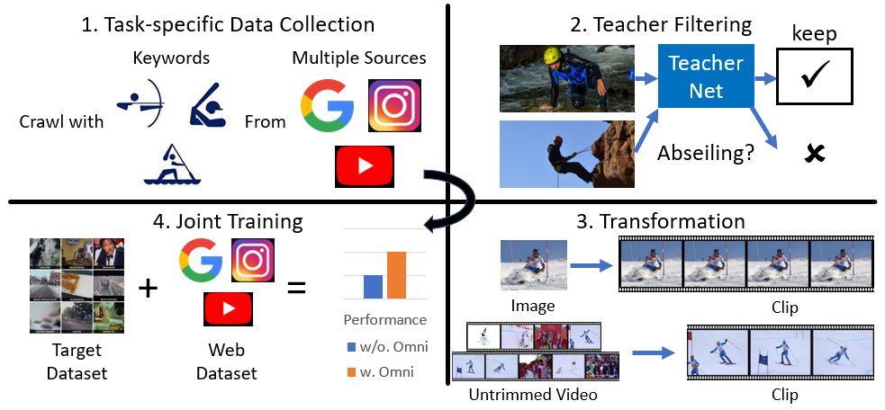

# Omni-sourced Webly-supervised Learning for Video Recognition

[Haodong Duan](https://github.com/kennymckormick), [Yue Zhao](https://github.com/zhaoyue-zephyrus), [Yuanjun Xiong](https://github.com/yjxiong), Wentao Liu, [Dahua Lin](https://github.com/lindahua)

In ECCV, 2020. [Paper](https://arxiv.org/abs/2003.13042)



### Release

We currently released 4 models trained with OmniSource framework, including both 2D and 3D architectures. We compare the performance of models trained with or without OmniSource in the following table.

|  Model   | Modality | Pretrained | Backbone  | Input |   Resolution   | Top-1 (Baseline / OmniSource (Delta)) | Top-5 (Baseline / OmniSource (Delta))) |                           Download                           |
| :------: | :------: | :--------: | :-------: | :---: | :------------: | :-----------------------------------: | :------------------------------------: | :----------------------------------------------------------: |
|   TSN    |   RGB    |  ImageNet  | ResNet50  | 3seg  |    340x256     |          70.6 / 73.6 (+ 3.0)          |          89.4 / 91.0 (+ 1.6)           | [Baseline](https://download.openmmlab.com/mmaction/recognition/tsn/tsn_r50_1x1x3_100e_kinetics400_rgb/tsn_r50_1x1x3_100e_kinetics400_rgb_20200614-e508be42.pth) / [OmniSource](https://download.openmmlab.com/mmaction/recognition/tsn/omni/tsn_imagenet_pretrained_r50_omni_1x1x3_kinetics400_rgb_20200926-54192355.pth) |
|   TSN    |   RGB    |   IG-1B    | ResNet50  | 3seg  | short-side 320 |          73.1 / 75.7 (+ 2.6)          |          90.4 / 91.9 (+ 1.5)           | [Baseline](https://download.openmmlab.com/mmaction/recognition/tsn/omni/tsn_1G1B_pretrained_r50_without_omni_1x1x3_kinetics400_rgb_20200926-c133dd49.pth) / [OmniSource](https://download.openmmlab.com/mmaction/recognition/tsn/omni/tsn_1G1B_pretrained_r50_omni_1x1x3_kinetics400_rgb_20200926-2863fed0.pth) |
| SlowOnly |   RGB    |  Scratch   | ResNet50  | 4x16  | short-side 320 |          72.9 / 76.8 (+ 3.9)          |          90.9 / 92.5 (+ 1.6)           | [Baseline](https://download.openmmlab.com/mmaction/recognition/slowonly/slowonly_r50_4x16x1_256e_kinetics400_rgb/slowonly_r50_4x16x1_256e_kinetics400_rgb_20200704-a69556c6.pth) / [OmniSource](https://download.openmmlab.com/mmaction/recognition/slowonly/omni/slowonly_r50_omni_4x16x1_kinetics400_rgb_20200926-51b1f7ea.pth) |
| SlowOnly |   RGB    |  Scratch   | ResNet101 |  8x8  | short-side 320 |          76.5 / 80.4 (+ 3.9)          |          92.7 / 94.4 (+ 1.7)           | [Baseline](https://download.openmmlab.com/mmaction/recognition/slowonly/omni/slowonly_r101_without_omni_8x8x1_kinetics400_rgb_20200926-0c730aef.pth) / [OmniSource](https://download.openmmlab.com/mmaction/recognition/slowonly/omni/slowonly_r101_omni_8x8x1_kinetics400_rgb_20200926-b5dbb701.pth) |

We will soon release the web dataset and training code used by OmniSource.

### Citing OmniSource

If you find OmniSource useful for your research, please consider citing the paper using the following BibTeX entry.

```
@article{duan2020omni,
  title={Omni-sourced Webly-supervised Learning for Video Recognition},
  author={Duan, Haodong and Zhao, Yue and Xiong, Yuanjun and Liu, Wentao and Lin, Dahua},
  journal={arXiv preprint arXiv:2003.13042},
  year={2020}
}
```
