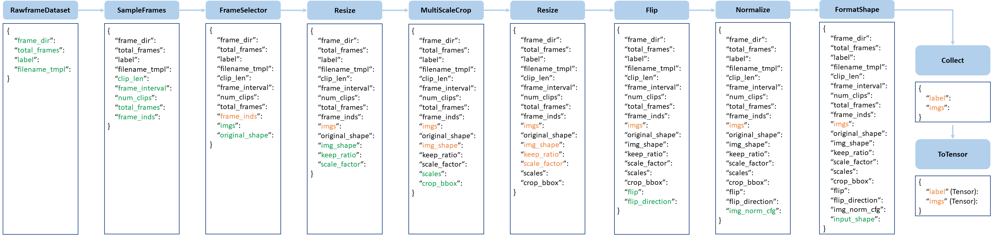

# 教程 4：如何设计数据处理流程

在本教程中，我们将介绍一些有关数据前处理流水线设计的方法，以及如何为项目自定义和扩展自己的数据流水线。

<!-- TOC -->

- [数据前处理流水线设计](#数据前处理流水线设计)
  - [数据加载](#数据加载)
  - [数据预处理](#数据预处理)
  - [数据格式化](#数据格式化)
- [扩展和使用自定义流水线](#扩展和使用自定义流水线)

<!-- TOC -->

## 数据前处理流水线设计

按照惯例，MMAction2 使用 `Dataset` 和 `DataLoader` 实现多进程数据加载。 `Dataset` 返回一个字典，作为模型的输入。
由于动作识别和时序动作检测的数据大小不一定相同（图片大小，边界框大小等），MMAction2 使用 MMCV 中的 `DataContainer` 收集和分配不同大小的数据，
详情可见 [这里](https://github.com/open-mmlab/mmcv/blob/master/mmcv/parallel/data_container.py)。

“数据前处理流水线” 和 “数据集构建” 是相互解耦的。通常，“数据集构建” 定义如何处理标注文件，“数据前处理流水线” 定义数据加载、预处理、格式化等功能（后文将详细介绍）。
数据前处理流水线由一系列相互解耦的操作组成。每个操作都输入一个字典（dict），新增/更新/删除相关字段，最终输出该字典，作为下一个操作的输入。

我们在下图中展示了一个典型的流水线。 蓝色块是流水线操作。
随着流水线的深入，每个操作都可以向结果字典添加新键（标记为绿色）或更新现有键（标记为橙色）。



这些操作分为数据加载，数据预处理和数据格式化。

这里以 TSN 的数据前处理流水线为例：

```python
img_norm_cfg = dict(
    mean=[123.675, 116.28, 103.53], std=[58.395, 57.12, 57.375], to_bgr=False)
train_pipeline = [
    dict(type='SampleFrames', clip_len=1, frame_interval=1, num_clips=3),
    dict(type='RawFrameDecode', io_backend='disk'),
    dict(type='Resize', scale=(-1, 256)),
    dict(
        type='MultiScaleCrop',
        input_size=224,
        scales=(1, 0.875, 0.75, 0.66),
        random_crop=False,
        max_wh_scale_gap=1),
    dict(type='Resize', scale=(224, 224), keep_ratio=False),
    dict(type='Flip', flip_ratio=0.5),
    dict(type='Normalize', **img_norm_cfg),
    dict(type='FormatShape', input_format='NCHW'),
    dict(type='Collect', keys=['imgs', 'label'], meta_keys=[]),
    dict(type='ToTensor', keys=['imgs', 'label'])
]
val_pipeline = [
    dict(
        type='SampleFrames',
        clip_len=1,
        frame_interval=1,
        num_clips=3,
        test_mode=True),
    dict(type='RawFrameDecode', io_backend='disk'),
    dict(type='Resize', scale=(-1, 256)),
    dict(type='CenterCrop', crop_size=224),
    dict(type='Flip', flip_ratio=0),
    dict(type='Normalize', **img_norm_cfg),
    dict(type='FormatShape', input_format='NCHW'),
    dict(type='Collect', keys=['imgs', 'label'], meta_keys=[]),
    dict(type='ToTensor', keys=['imgs'])
]
test_pipeline = [
    dict(
        type='SampleFrames',
        clip_len=1,
        frame_interval=1,
        num_clips=25,
        test_mode=True),
    dict(type='RawFrameDecode', io_backend='disk'),
    dict(type='Resize', scale=(-1, 256)),
    dict(type='TenCrop', crop_size=224),
    dict(type='Flip', flip_ratio=0),
    dict(type='Normalize', **img_norm_cfg),
    dict(type='FormatShape', input_format='NCHW'),
    dict(type='Collect', keys=['imgs', 'label'], meta_keys=[]),
    dict(type='ToTensor', keys=['imgs'])
]
```

MMAction2 也支持一些 lazy 操作符。
Lazy 操作记录如何处理数据，但是它会推迟对原始数据的处理，直到进入 Fuse 阶段。
具体而言，lazy 操作符避免了对原始数据的频繁读取和修改操作，只在最后的 Fuse 阶段中对原始数据进行了一次处理，从而加快了数据预处理速度，因此，推荐用户使用本功能。

这是使用 lazy 运算符的数据前处理流水线的例子：

```python
train_pipeline = [
    dict(type='SampleFrames', clip_len=32, frame_interval=2, num_clips=1),
    dict(type='RawFrameDecode', decoding_backend='turbojpeg'),
    # 以下三个 lazy 操作符仅处理帧的 bbox 而不修改原始数据。
    dict(type='Resize', scale=(-1, 256), lazy=True),
    dict(
        type='MultiScaleCrop',
        input_size=224,
        scales=(1, 0.8),
        random_crop=False,
        max_wh_scale_gap=0,
        lazy=True),
    dict(type='Resize', scale=(224, 224), keep_ratio=False, lazy=True),
    # lazy 操作符 “Flip” 仅记录是否应该翻转框架和翻转方向。
    dict(type='Flip', flip_ratio=0.5, lazy=True),
    # 在 Fuse 阶段处理一次原始数据
    dict(type='Fuse'),
    dict(type='Normalize', **img_norm_cfg),
    dict(type='FormatShape', input_format='NCTHW'),
    dict(type='Collect', keys=['imgs', 'label'], meta_keys=[]),
    dict(type='ToTensor', keys=['imgs', 'label'])
]
```

本节将所有操作分为数据加载、数据预处理、数据格式化三类，列出每个操作 新增/更新/删除 的相关字典字段，其中 `*` 代表所对应的键值不一定会被影响。

### 数据加载

`SampleFrames`

- 新增: frame_inds, clip_len, frame_interval, num_clips, *total_frames

`DenseSampleFrames`

- 新增: frame_inds, clip_len, frame_interval, num_clips, *total_frames

`PyAVDecode`

- 新增: imgs, original_shape
- 更新: *frame_inds

`DecordDecode`

- 新增: imgs, original_shape
- 更新: *frame_inds

`OpenCVDecode`

- 新增: imgs, original_shape
- 更新: *frame_inds

`RawFrameDecode`

- 新增: imgs, original_shape
- 更新: *frame_inds

### 数据预处理

`RandomCrop`

- 新增: crop_bbox, img_shape
- 更新: imgs

`RandomResizedCrop`

- 新增: crop_bbox, img_shape
- 更新: imgs

`MultiScaleCrop`

- 新增: crop_bbox, img_shape, scales
- 更新: imgs

`Resize`

- 新增: img_shape, keep_ratio, scale_factor
- 更新: imgs

`Flip`

- 新增: flip, flip_direction
- 更新: imgs, label

`Normalize`

- 新增: img_norm_cfg
- 更新: imgs

`CenterCrop`

- 新增: crop_bbox, img_shape
- 更新: imgs

`ThreeCrop`

- 新增: crop_bbox, img_shape
- 更新: imgs

`TenCrop`

- 新增: crop_bbox, img_shape
- 更新: imgs

`MultiGroupCrop`

- 新增: crop_bbox, img_shape
- 更新: imgs

### 数据格式化

`ToTensor`

- 更新: specified by `keys`.

`ImageToTensor`

- 更新: specified by `keys`.

`Transpose`

- 更新: specified by `keys`.

`Collect`

- 新增: img_metas (所有需要的图像元数据，会被在此阶段整合进 `meta_keys` 键值中)
- 删除: 所有没有被整合进 `keys` 的键值

**值得注意的是**，第一个键，通常是 `imgs`，会作为主键用来计算批大小。

`FormatShape`

- 新增: input_shape
- 更新: imgs

## 扩展和使用自定义流水线

1. 在任何文件写入一个新的处理流水线，如 `my_pipeline.py`。它以一个字典作为输入并返回一个字典

    ```python
    from mmaction.datasets import PIPELINES

    @PIPELINES.register_module()
    class MyTransform:

        def __call__(self, results):
            results['key'] = value
            return results
    ```

2. 导入新类

    ```python
    from .my_pipeline import MyTransform
    ```

3. 在配置文件使用它

    ```python
    img_norm_cfg = dict(
         mean=[123.675, 116.28, 103.53], std=[58.395, 57.12, 57.375], to_rgb=True)
    train_pipeline = [
        dict(type='DenseSampleFrames', clip_len=8, frame_interval=8, num_clips=1),
        dict(type='RawFrameDecode', io_backend='disk'),
        dict(type='MyTransform'),       # 使用自定义流水线操作
        dict(type='Normalize', **img_norm_cfg),
        dict(type='FormatShape', input_format='NCTHW'),
        dict(type='Collect', keys=['imgs', 'label'], meta_keys=[]),
        dict(type='ToTensor', keys=['imgs', 'label'])
    ]
    ```
